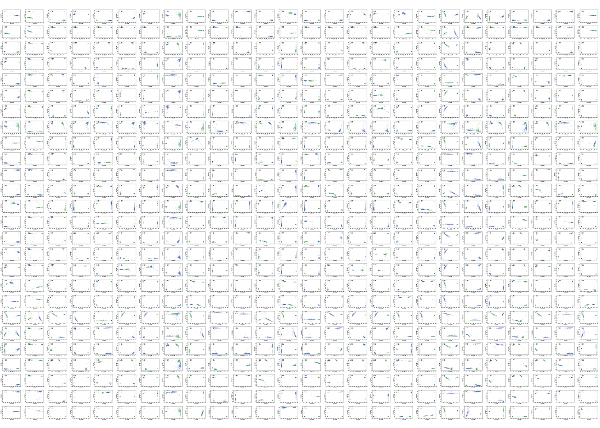
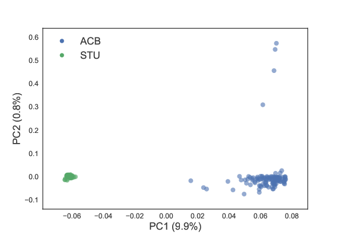

# PCA for every single pair of populations in the 1000 Genomes Populations
Full description to come. In the mean time you can [see the pdf version here](results/all_pairwise_pca.pdf) or you can look at single figures in the `figures` folder of this repository. 

Low quality png render: 

Example of pca for a pair of populations. All of the pairs can be found in the `figures` folder. 

